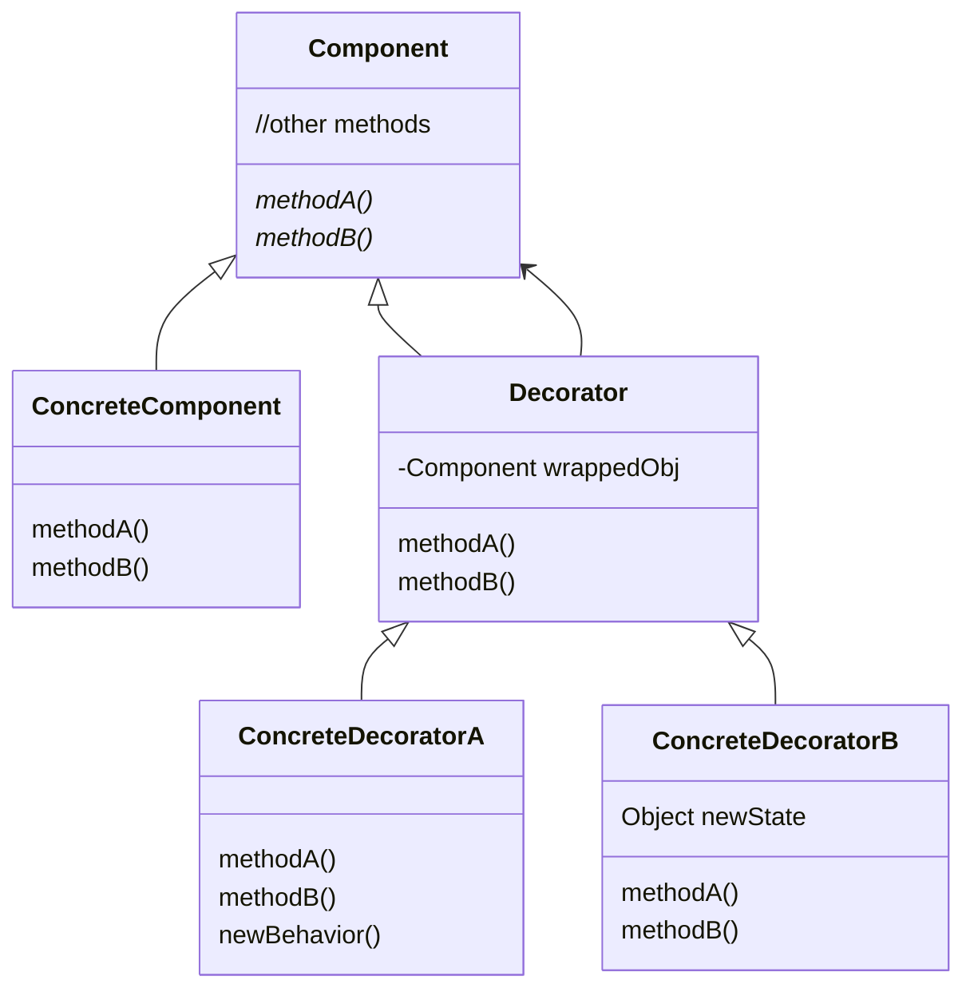

>Related Book ***Head First Design Pattern***

## Definition
> ***The Decorator Pattern*** *attaches additional responsibilities to an object dynamically.*
> *Decorators provide a flexible alternative to subclassing for extending functinality*

## Design Principle - **The Open-Closed Principle**
Classes should be open for extension, but closed for modification.

## Structure


## Example


```java
//Beverage.java
public abstract class Beverage {
    String description = "Unknown Beverage";
    public String getDescription(){ return description; }
    @Override
    public String toString(){ return getDescription() + " $" + cost(); }
    public abstract double cost();
}
//CondimentDecorator.java
public abstract class CondimentDecorator extends Beverage{
    public abstract String getDescription();
}
//Espresso.java
public class Espresso extends Beverage{
    public Espresso(){ description = "Espresso"; }

    @Override
    public double cost() { return 1.99; }
}
//Soy.java
public class Soy extends CondimentDecorator{
    Beverage beverage;

    public Soy(Beverage beverage){ this.beverage = beverage; }

    @Override
    public String getDescription() { return this.beverage.getDescription() + " ,Soy"; }

    @Override
    public double cost(){ return 0.10 + this.beverage.cost(); }
}
//SteamedMilk.java
public class SteamedMilk extends CondimentDecorator{
    Beverage beverage;

    public SteamedMilk(Beverage beverage){ this.beverage = beverage; }

    @Override
    public String getDescription() { return this.beverage.getDescription() + ", Steamed Milk"; }

    @Override
    public double cost() { return 0.10 + this.beverage.cost(); }
}
//Mocha.java
public class Mocha extends CondimentDecorator{
    Beverage beverage;

    public Mocha(Beverage beverage){ this.beverage = beverage; }

    @Override
    public String getDescription() { return beverage.getDescription() + ", Mocha"; }

    @Override
    public double cost() { return 0.20 + beverage.cost(); }
}
//Main.java
public class Main {
    public static void main(String[] args){
        Espresso espresso = new Espresso();
        Mocha mocha = new Mocha(espresso);
        println(new Soy(new SteamedMilk(mocha)));
    }
    static void println(Object obj){
        System.out.println(obj);
    }
}
/* Output:
* Espresso, Mocha, Steamed Milk ,Soy $2.39
*/
```

```kotlin
interface Beverage{
    var description: String
    fun cost():Double
}

abstract class CondimentDecorator(val beverage: Beverage) : Beverage by beverage {
    override var description: String = ""
    override fun toString():String = "$description $${cost()}"
}

class Espresso(override var description: String = "Espresso") : Beverage{
    override fun cost():Double = 1.99
    override fun toString():String = "$description $ ${cost()}"
}

class Soy(beverage: Beverage) : CondimentDecorator(beverage){
    override var description: String = "${beverage.description}, Soy"
    override fun cost(): Double = 0.10 + beverage.cost()
}

class Mocha(beverage: Beverage) : CondimentDecorator(beverage){
    override var description: String = "${beverage.description}, Mocha"
    override fun cost(): Double = 0.20 + beverage.cost()
}

class SteamedMilk(beverage: Beverage) : CondimentDecorator(beverage){
    override var description: String = "${beverage.description}, Steamed Milk"
    override fun cost(): Double = 0.10 + beverage.cost()
}

fun main(args:Array<String>){
    var espresso = Espresso()
    var mocha = Mocha(espresso)
    println(Soy(SteamedMilk(mocha)))
}
```